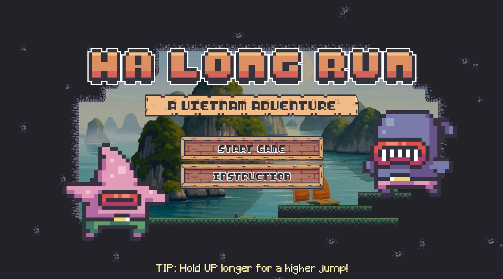
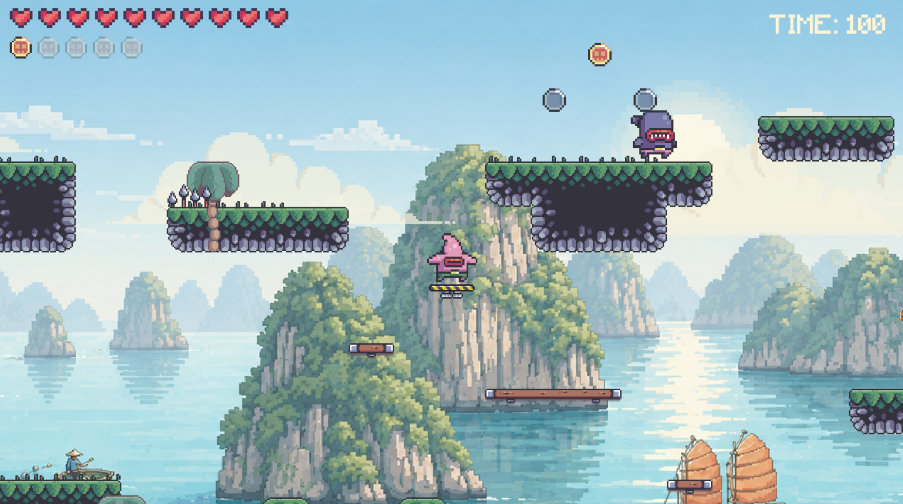
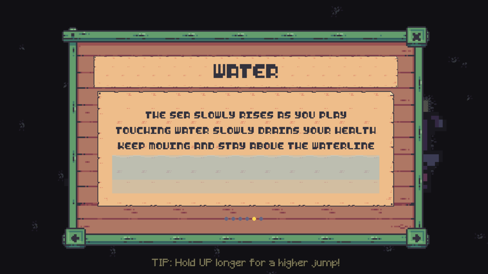
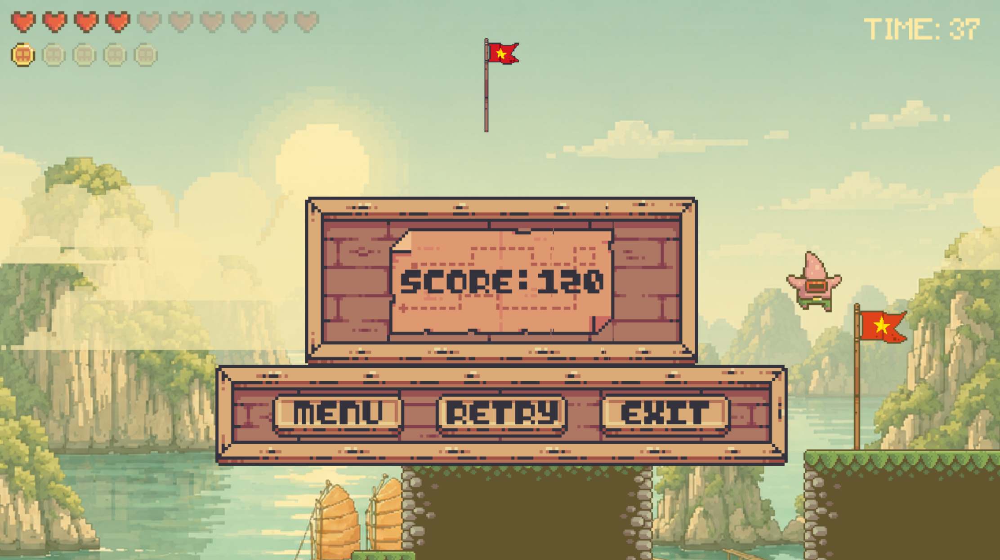

# Ha Long Run

Ha Long Run is a 2D platformer built with `pygame` and `pytmx`. You play through a Vietnam-inspired level, collect coins, avoid hazards, outrun rising water, and reach the flag before time runs out.

One of the best projects from the SEO Tech Developer Program 2026.

The game opens with a custom title screen that introduces the playful Vietnam adventure tone right away.



## Features

- Vietnam-themed platformer presentation and UI
- Tilemap-based level using TMX assets
- Animated player, enemies, collectibles, and environmental objects
- Rising water pressure that drains health over time
- Coins, health pickups, and short invincibility pickups
- Start, win, and lose screens with custom UI art

The main level combines platforming, enemies, pickups, and a timer into a fast escape across the map.



## Controls

- `Left Arrow` / `Right Arrow`: move
- `Up Arrow`: jump
- `Down Arrow` or `E`: activate the lever / call the boat

The game also includes a built-in instruction panel that explains movement, pickups, hazards, water danger, and victory rules in the same visual style as the rest of the UI.



## Win and Lose Conditions

- You have `2 minutes` to finish the level.
- Reach the flag at the end of the map to win.
- You lose if time runs out.
- You lose if your health reaches zero.
- Water and hazards can damage you, so keep moving.

Clearing the stage leads to a dedicated win screen that matches the game's custom interface style.



## Scoring and Health

- Silver coin: `10`
- Gold coin: `20`
- Bami pickup: `30` and temporary invincibility
- Lantern pickup: `50`
- Lotus pickup: `+1` heart
- Every `100` coins earned gives `+1` heart

## Requirements

- Python 3.10+
- `pygame`
- `pytmx`

## Install

```bash
pip install pygame pytmx
```

## Run

```bash
python main.py
```

## Project Structure

```text
.
|-- main.py
|-- settings.py
|-- classes/
|-- asset/
|-- data/
|-- font/
|-- start_game.png
|-- instruction.png
|-- main_game.png
`-- win_game.png
```
